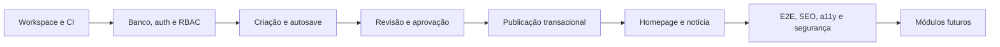

# Plano de implementação — Triunfo FM 87,9

Status da execução atual: Fase 0 concluída documentalmente  
Próxima execução autorizada: somente após aceite desta base  
Estratégia: vertical editorial antes da expansão de módulos

## 1. Resultado que governa o plano

A primeira release funcional deverá comprovar esta jornada:

```text
login no painel
→ criação da matéria
→ revisão editorial
→ aprovação
→ publicação
→ exibição na homepage
→ página pública da notícia com SEO
```

Nenhum módulo de rádio, turismo, eventos, podcasts ou publicidade deve desviar a equipe antes desse E2E passar com usuários de papéis diferentes.

## 2. Fase 0 — diagnóstico e planejamento

Status: concluída nesta execução.

Entregas:

- especificação canônica em `docs/MASTER_SPEC.md`;
- diagnóstico greenfield do repositório;
- análise técnica e visual dos quatro ativos;
- `docs/architecture.md`;
- `docs/data-model.md`;
- `docs/design-system.md`;
- `docs/editorial-workflow.md`;
- `docs/seo-geo.md`;
- `IMPLEMENTATION_PLAN.md`;
- `DECISIONS.md`.

Não realizado, por restrição explícita:

- inicialização de Git/workspace;
- código, dependências ou servidor;
- schema Prisma/migrations/seed;
- autenticação;
- UI;
- Docker;
- testes de aplicação;
- deploy.

## 3. Release 1 — vertical editorial

### 1A. Fundação do repositório

Entregas:

- Git e baseline da Fase 0;
- pnpm workspaces;
- `apps/web` e pacotes definidos na arquitetura;
- Next.js App Router e TypeScript strict;
- ESLint, Prettier, Vitest e Playwright;
- tokens e primitives acessíveis;
- `.env.example`;
- Docker Compose com PostgreSQL, MinIO e e-mail local;
- CI para install, lint, typecheck, test e build.

Gate:

- ambiente inicia seguindo README;
- build vazio passa;
- integrações opcionais podem ficar sem credencial.

### 1B. Banco, autenticação e RBAC

Entregas:

- spike e escolha do adapter de autenticação atual;
- schema inicial da vertical;
- migrations SQL revisadas;
- seed demonstrativo;
- login/logout/recuperação básica;
- sessão revogável;
- guardas de rota e autorização em casos de uso;
- papéis e permissões da vertical;
- auditoria de login e alteração de acesso.

Gate:

- usuário inativo não entra;
- anônimo não acessa `/admin`;
- redator não publica;
- alteração crítica de permissão revoga sessão;
- testes negativos de IDOR/RBAC passam.

### 1C. CMS e criação de matéria

Entregas:

- layout administrativo;
- fila/lista de conteúdos;
- formulário de matéria;
- TipTap com schema allowlist;
- working copy e autosave com concorrência otimista;
- categoria, tags, fontes e mídia principal;
- campos SEO/GEO iniciais;
- preview protegida/noindex;
- checkpoints de revisão.

Gate:

- redator cria, salva, reabre e envia;
- conflito não perde conteúdo;
- HTML é gerado/sanitizado no servidor;
- rascunho não possui URL pública indexável.

### 1D. Revisão, aprovação e publicação

Entregas:

- fila do revisor;
- comentários e pedidos de alteração;
- reenvio como nova revisão;
- endosso e aprovação da revisão exata;
- checklist de publicação;
- publicação transacional;
- slug e redirect;
- retirada do ar;
- timeline e AuditLog.

Gate:

- não há atalho normal de rascunho para publicado;
- edição depois de aprovação invalida a aprovação;
- nova edição de matéria no ar não substitui a revisão publicada;
- toda transição tem ator e revisão.

### 1E. Portal público e SEO

Entregas:

- header/footer mínimos da marca;
- homepage com `LATEST_NEWS` automático e `FEATURED_NEWS` manual;
- `/noticias/[slug]`;
- cards e página responsivos;
- canonical, metadata, Open Graph e JSON-LD;
- breadcrumb, autor, datas, mídia, fontes e correções;
- cache por tags e invalidação após publicação;
- 404/retirada coerentes.

Gate:

- matéria publicada aparece na homepage e página;
- ambas usam o mesmo `publishedRevisionId`;
- rascunho/revisão nunca aparece;
- metadata/JSON-LD correspondem ao conteúdo;
- viewports 390, 768, 1024, 1280 e 1440 são utilizáveis.

### 1F. Qualidade da vertical

Entregas:

- unitários da state machine, slug, sanitizer e RBAC;
- integração de constraints e publicação;
- E2E completo com Redator, Revisor e Editor;
- testes de acesso negado e revisão obsoleta;
- axe e inspeção manual por teclado;
- análise de segurança, logs e erros;
- orçamento inicial de Core Web Vitals;
- documentação operacional.

Gate final:

1. Login funciona.
2. Papéis respeitam limites.
3. Redator cria e envia.
4. Revisor solicita mudanças/endossa.
5. Editor aprova e publica.
6. Homepage e notícia exibem a revisão correta.
7. Alteração posterior não aprovada não muda o ar.
8. SEO básico é válido.
9. Auditoria existe.
10. CI e E2E passam com banco limpo.

## 4. Release 2 — operação editorial ampliada

Somente após o gate da Release 1:

- agendamento idempotente;
- comparação/restauração avançada;
- calendário editorial;
- galeria e mídia ampliada;
- homepage builder controlado;
- categorias e páginas de autor;
- busca PostgreSQL Full Text Search;
- sitemap/RSS/JSON Feed completos;
- política editorial e correções;
- painel SEO/GEO ampliado.

## 5. Release 3 — rádio e programação

- stream principal/fallback;
- programas, apresentadores e grade semanal;
- now playing manual/adapter;
- player persistente e acessível;
- página ao vivo e programação;
- métricas técnicas de reprodução.

Credenciais/URL reais são configuração; demonstração nunca simula uma emissora real no ar.

## 6. Release 4 — turismo, eventos e podcasts

Implementar por verticais independentes:

1. turismo e guia;
2. eventos e recorrência;
3. podcasts, episódios, áudio e transcrição.

Cada vertical inclui schema, painel, portal, SEO/GEO, permissões e E2E antes da próxima.

## 7. Release 5 — publicidade e analytics

- anunciantes, campanhas, criativos e placements;
- identificação inequívoca de publicidade;
- impressão/clique com minimização LGPD;
- consentimento;
- relatórios e dashboard;
- integrações opcionais de analytics/observabilidade.

Nenhum tracking pessoal desnecessário é requisito de monetização.

## 8. Release 6 — hardening e produção

- testes completos e regressão visual relevante;
- pentest/revisão de segurança;
- performance e acessibilidade;
- backup/restore;
- runbooks, alertas e retenção;
- ambiente de homologação;
- checklist LGPD;
- deploy e rollback;
- `IMPLEMENTATION_STATUS.md` final.

## 9. Dependências e sequência



Trabalho visual pode ocorrer em paralelo após os tokens, mas não substitui os gates de dados e permissão.

## 10. Estratégia de testes da vertical

| Camada | Cobertura |
|---|---|
| Unitária | state machine, política RBAC, slug, sanitização, SEO rules |
| Integração | repositories, constraints, transações, sessão, publicação |
| E2E | login → criação → revisão → aprovação → publicação → portal |
| Acessibilidade | teclado, foco, nomes/erros e axe |
| Segurança | brute force, sessão revogada, IDOR, XSS, CSRF e preview |
| Performance | homepage e notícia, imagem LCP, cache/invalidação |

## 11. Dados demonstrativos

Seed local mínimo:

- superadmin;
- editor;
- revisor;
- redator;
- categorias;
- uma matéria demonstrativa por estado;
- homepage mínima.

Todo texto fictício terá rótulo “Conteúdo de demonstração”. Senhas locais ficam no README de desenvolvimento, nunca em produção.

## 12. Riscos de execução

| Risco | Ação preventiva |
|---|---|
| Escopo amplo interromper a vertical | gate explícito antes dos módulos futuros |
| Adapter de auth incompatível | spike curto antes do schema definitivo |
| Docker ausente no ambiente atual | preparar pré-requisito/alternativa na Fase 1 |
| Assets sem kit oficial | usar tokens provisórios; solicitar vetores |
| Conflito de edição | `lockVersion` desde o início |
| Publicação expor revisão errada | ponteiro publicado e teste transacional |
| Cache divergente | revalidação pós-commit, TTL e telemetria |
| Dados inventados | configuração vazia e rótulo de demonstração |
| Prisma não expressar invariantes | migration SQL e testes |

## 13. Definition of Done

Uma etapa só é concluída quando código, migration, autorização, validação, UI, estados de erro, acessibilidade, teste e documentação aplicáveis estão prontos. Tela estática ou mock permanente não satisfaz uma vertical.
