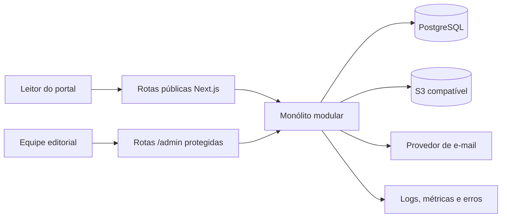
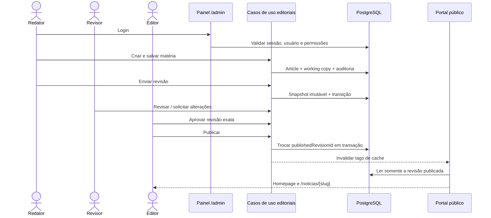

# Arquitetura do Ecossistema Digital Triunfo FM 87,9

Status: proposta aprovada para a Fase 0  
Data: 2026-07-29  
Escopo prioritário: login no painel → criação da matéria → revisão editorial → publicação → homepage e página da notícia

## 1. Objetivo e limites

Esta arquitetura estabelece a base técnica do produto descrito em `docs/MASTER_SPEC.md`. A primeira entrega funcional deve validar, de ponta a ponta, identidade, autorização, persistência, workflow editorial, publicação, renderização pública e SEO.

Esta Fase 0 é exclusivamente documental. Não inclui inicialização de aplicação, dependências, banco, migrations, seed, autenticação, telas ou deploy.

## 2. Diagnóstico do repositório

O diretório é greenfield e contém somente quatro ativos visuais:

- `triunfo-fm-logo.png.png`;
- `triunfo-fm-simbolo.png`;
- `triunfo-fm-frontend-reference.png.png`;
- `news-portal-layout-reference.jpg.jpg`.

Não existem ainda `.git`, `package.json`, workspace, código-fonte, testes, Docker, variáveis de ambiente ou documentação interna. A especificação fornecida como anexo foi adotada como fonte canônica e preservada em `docs/MASTER_SPEC.md`. Os nomes reais dos ativos possuem extensões duplicadas em três arquivos; os originais serão preservados e normalizados apenas quando forem incorporados à aplicação.

## 3. Decisão arquitetural

Será adotado um monólito modular em monorepositório pnpm, com uma única aplicação Next.js no primeiro ciclo. Portal público e painel administrativo compartilharão o mesmo processo e o mesmo domínio, mas terão route groups, layouts, políticas de cache e guardas de acesso separados.

Essa decisão:

- reduz a complexidade de sessão, deploy e consistência transacional;
- permite publicar uma matéria e invalidar o portal no mesmo sistema;
- mantém uma API versionável para o futuro aplicativo;
- preserva fronteiras internas que permitem extração posterior, caso haja motivo operacional comprovado;
- evita microserviços e dois frontends prematuros.

A extração do painel para uma aplicação independente só será reconsiderada se houver equipe, cadência de deploy, requisitos de isolamento ou orçamento de performance realmente distintos.

## 4. Visão de contexto



O PostgreSQL é a fonte de verdade para conteúdo, permissões, workflow e auditoria. O armazenamento S3-compatible guarda os bytes de imagens, áudio e vídeo; o banco guarda metadados e relações. Integrações externas são acessadas por adapters e não pelo domínio diretamente.

## 5. Estrutura proposta

```text
/
├── apps/
│   └── web/
│       └── src/
│           ├── app/
│           │   ├── (public)/
│           │   ├── (backoffice)/admin/
│           │   ├── api/v1/
│           │   └── preview/
│           └── modules/
│               ├── identity/
│               ├── access-control/
│               ├── editorial/
│               ├── taxonomy/
│               ├── media/
│               ├── homepage/
│               ├── delivery/
│               └── audit/
├── packages/
│   ├── auth/
│   ├── config/
│   ├── database/
│   ├── seo/
│   ├── types/
│   ├── ui/
│   └── validation/
├── tests/
│   └── e2e/
├── docs/
└── infra/
    └── docker/
```

`apps/web` conterá portal e painel na primeira vertical. `packages/database` será o único ponto de definição do Prisma Client, schema e migrations. `packages/ui` conterá primitives acessíveis; componentes específicos de matéria, revisão ou homepage permanecerão nos módulos de produto. `packages/types` não duplicará tipos já derivados de Prisma ou Zod.

## 6. Fronteiras dos módulos

| Módulo | Responsabilidade inicial | Não deve fazer |
|---|---|---|
| Identity | login, logout, sessão, recuperação e estado do usuário | decidir permissão editorial |
| Access control | RBAC, escopos `OWN/ASSIGNED/ANY` e guardas contextuais | renderizar interface |
| Editorial | matéria, working copy, revisões, comentários e state machine | acessar cache ou storage diretamente |
| Taxonomy | categorias, subcategorias e tags | conhecer layout da homepage |
| Media | metadados, upload seguro e adapter S3 | definir texto alternativo fora do contexto de uso |
| Homepage | seções controladas e seleção de matéria publicada | expor rascunhos |
| Delivery | consultas públicas, metadata, JSON-LD, sitemap, RSS e cache | executar mutações editoriais |
| Audit | eventos de segurança e negócio append-only | armazenar segredo ou corpo integral da matéria |

As dependências seguem a direção `UI/API → application use cases → domain → repositories/adapters`. Route handlers, Server Actions e páginas nunca acessam Prisma diretamente. Todas as mutações passam por casos de uso com validação Zod, autorização no servidor e transação quando houver mudança de estado.

## 7. Primeira vertical funcional



Invariantes:

- a publicação aponta para uma revisão imutável e aprovada;
- uma nova edição nunca substitui silenciosamente o conteúdo que está no ar;
- a homepage e a página da notícia usam o mesmo `publishedRevisionId`;
- cliente nenhum decide autorização;
- toda transição registra ator, horário, revisão, motivo e request ID;
- publicação, reserva de slug, redirect e eventos de workflow são atômicos;
- falha pós-commit na invalidação de cache é observável e retentável, sem reverter o banco.

## 8. Workflow e visibilidade

Workflow editorial e situação pública são dimensões diferentes:

- `EditorialStatus`: `DRAFT`, `IN_REVIEW`, `CHANGES_REQUESTED`, `APPROVED`;
- `PublicationStatus`: `NEVER_PUBLISHED`, `SCHEDULED`, `PUBLISHED`, `UNPUBLISHED`, `ARCHIVED`.

Isso permite que uma matéria continue publicada enquanto uma atualização está em rascunho. A interface exibirá os dois estados quando necessário, por exemplo “No ar” e “Alterações em revisão”. A elegibilidade pública depende do ponteiro publicado, datas e exclusão lógica, não de um badge isolado.

## 9. Autenticação e autorização

O painel exige autenticação própria para a equipe da rádio. A implementação utilizará Auth.js ou solução equivalente compatível com App Router, PostgreSQL, sessões revogáveis e credenciais seguras. A escolha final do adapter será confirmada por um spike curto na Fase 1 para evitar acoplamento a comportamento específico de versão.

Requisitos não negociáveis:

- hash de senha com algoritmo resistente e parâmetros revisáveis;
- cookie `HttpOnly`, `Secure` em produção e `SameSite` adequado;
- sessões revogadas após desativação, mudança de senha ou alteração crítica de acesso;
- rate limiting para login, recuperação e endpoints sensíveis;
- mensagem de erro que não revele existência de conta;
- recuperação com token opaco, armazenado como hash, de uso único e com expiração;
- segundo fator preparado, mas não obrigatório na primeira vertical;
- autenticação identifica o usuário; autorização é reavaliada em cada mutação no servidor.

O RBAC combina recurso, ação e escopo. Os papéis iniciais da vertical são `SUPER_ADMIN`, `EDITOR_CHEFE`, `EDITOR`, `REVISOR` e `REDATOR`. `ADMIN` não recebe automaticamente poder editorial: isso depende de permissões explícitas. O fluxo normal aplica segregação de funções; override de superadmin exige motivo e auditoria.

## 10. Persistência e consistência

- PostgreSQL e Prisma são a base relacional.
- IDs serão UUID e datas `timestamptz` em UTC; a interface opera em `America/Recife`.
- Conteúdo TipTap JSON é canônico; HTML é uma projeção gerada e sanitizada no servidor.
- Working copy mutável atende ao autosave; revisões são checkpoints imutáveis.
- JSONB é reservado para documentos estruturados e metadados versionados, não para substituir relações centrais.
- Índices parciais, checks, case-insensitive unique e full-text serão adicionados por migrations SQL quando Prisma não os expressar.
- Exclusão lógica vale para entidades operacionais; revisão, transição e auditoria são append-only.
- Mídia fica em S3-compatible, com MinIO no ambiente local e adapter neutro de fornecedor.

O modelo detalhado está em `docs/data-model.md`.

## 11. Renderização pública, cache e API

Rotas públicas usam Server Components por padrão, HTML indexável e cache por tags. Rotas administrativas são dinâmicas e `no-store`. A publicação invalida, no mínimo, as tags da matéria, homepage, categoria, sitemap e feed.

Consultas públicas devem:

1. localizar o artigo pelo slug público;
2. confirmar a elegibilidade pública;
3. carregar exatamente a revisão publicada;
4. produzir metadata e dados estruturados a partir da mesma revisão;
5. impedir que referências manuais da homepage revelem conteúdo não publicado.

Server Actions atenderão formulários próprios quando forem adequadas. `/api/v1` exporá contratos para integrações e aplicativo futuro. Ambos chamam os mesmos casos de uso e não duplicam regra de negócio. Não haverá API pública abrangente na primeira vertical.

## 12. Segurança e LGPD

Controles mínimos:

- validação no servidor e sanitização allowlist do HTML;
- CSP, headers de segurança e proteção CSRF conforme o mecanismo de mutação;
- checagem de tipo real, tamanho, dimensões, checksum e quarentena de upload;
- URLs assinadas para mídia privada;
- princípio de menor privilégio no banco e storage;
- segredos somente por ambiente;
- logs estruturados sem senha, token, cookie, corpo integral ou fonte confidencial;
- minimização e retenção definida para IP e user agent;
- preview autenticado ou com token curto, revogável e `noindex`;
- backups e restauração testada antes de produção;
- trilha de auditoria para login, permissão, revisão, aprovação, publicação e retirada.

## 13. SEO, GEO e acessibilidade

A página pública é server-rendered e usa elementos semânticos, canonical consistente, metadata, Open Graph, breadcrumbs e `NewsArticle` ou `Article` conforme o tipo real. JSON-LD é gerado por código a partir de dados validados; editores não inserem marcação arbitrária.

Conteúdo sugerido por IA nunca é publicado automaticamente. Campos GEO podem permanecer vazios; é preferível ausência a fatos, fontes ou citações inventadas. Todo ativo editorial exige crédito/licença apropriados e texto alternativo contextual quando a imagem transmite informação.

O produto adotará WCAG 2.2 AA como baseline, com navegação por teclado, foco visível, landmarks, erros associados aos campos, alvos de toque de pelo menos 44 × 44 px e suporte a redução de movimento.

## 14. Ambientes, entrega e observabilidade

Ambiente local planejado:

- Node LTS e pnpm fixados por arquivos de versão;
- Docker Compose para PostgreSQL, MinIO e capturador local de e-mail;
- aplicação executável sem credenciais de analytics, streaming ou observabilidade;
- seed exclusivamente demonstrativo e claramente rotulado.

Produção deverá usar banco gerenciado, storage S3-compatible, CDN, TLS e gestão de segredos. O fornecedor de hosting permanece aberto até a Fase 1, pois não altera o domínio.

Observabilidade:

- logs JSON com request ID e identidade técnica do ator;
- captura de exceções e métricas de latência/erro;
- health e readiness checks;
- auditoria de negócio separada dos logs operacionais;
- alertas para falha de publicação, invalidação, job agendado e storage.

## 15. Estratégia de testes

A vertical será aceita somente com:

- testes unitários da state machine e das guardas RBAC;
- testes de integração das transações, constraints e elegibilidade pública;
- Playwright cobrindo login → criação → revisão → aprovação → publicação → homepage → notícia;
- cenários negativos de acesso, autoaprovação, revisão obsoleta e rascunho não exposto;
- validação de metadata, canonical e JSON-LD;
- axe ou equivalente nas telas críticas;
- build, lint, typecheck e migration check na integração contínua.

## 16. Riscos e respostas

| Risco | Resposta arquitetural |
|---|---|
| Expor uma edição não aprovada | Ponteiro explícito para revisão publicada |
| Perda por autosave concorrente | Working copy e `lockVersion` |
| Permissões amplas por papel | RBAC por ação/escopo e guardas de estado |
| Cache manter conteúdo retirado | Elegibilidade no servidor, tags e TTL de segurança |
| Slug quebrar SEO | Reserva transacional e redirect 301 |
| XSS no corpo editorial | JSON estruturado e HTML sanitizado no servidor |
| Vazamento de fonte confidencial | Fora do modelo público inicial |
| Dependência prematura de fornecedor | Adapters para autenticação, storage, e-mail e analytics |
| Complexidade antes da vertical | Módulos futuros apenas documentados, não implementados |
| Ativos de marca inadequados | Solicitar versões vetoriais/flat antes do acabamento final |

## 17. Fora do escopo da primeira implementação

Rádio ao vivo, programação, turismo, eventos, podcasts, publicidade, analytics avançado, homepage builder completo, busca transversal, aplicativo e integrações externas permanecem planejados, mas não devem preceder a validação da vertical editorial.
