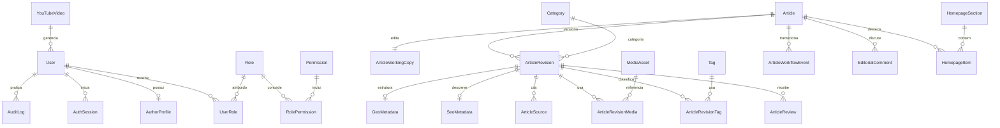

# Modelo de dados inicial

Status: proposta da Fase 0  
Banco alvo: PostgreSQL  
ORM alvo: Prisma  
Escopo: primeira vertical editorial + mídia digital (YouTube & App)

## 1. Princípios

- PostgreSQL é a fonte de verdade para identidade, permissões, conteúdo, workflow e auditoria.
- IDs são UUID; datas são `timestamptz` em UTC e exibidas em `America/Recife`.
- Prisma usa `PascalCase`; tabelas e colunas físicas usam `snake_case` por mapping.
- Entidades mutáveis têm `createdAt` e `updatedAt`; quando relevante, também `createdById`, `updatedById`, `deletedAt` e `deletedById`.
- Revisões, transições e auditoria são append-only.
- JSONB é usado para TipTap e estruturas versionadas; relações críticas permanecem normalizadas.
- Checks, índices parciais, unicidade case-insensitive e full-text podem exigir migrations SQL complementares ao Prisma.
- Nenhuma consulta pública lê working copy ou “última revisão”; ela usa explicitamente a revisão publicada.
- Bytes de mídia não ficam no PostgreSQL.

## 2. Dois eixos de estado

A lista de status da especificação mistura o trabalho editorial com a situação pública. O modelo persiste duas dimensões:

```text
EditorialStatus
DRAFT | IN_REVIEW | CHANGES_REQUESTED | APPROVED

PublicationStatus
NEVER_PUBLISHED | SCHEDULED | PUBLISHED | UNPUBLISHED | ARCHIVED
```

Assim, um artigo pode estar `PUBLISHED` e simultaneamente ter uma nova working copy em `DRAFT`. Os rótulos solicitados no MASTER_SPEC continuam presentes na interface, mas sem risco de uma atualização não aprovada substituir o conteúdo no ar.

## 3. Diagrama inicial



## 4. Mídia e Vídeos do YouTube

### YouTubeVideo

Gerenciamento de vídeos do canal oficial da Triunfo FM no painel `/admin/youtube`:

| Campo | Tipo lógico | Regra / Descrição |
|---|---|---|
| id | UUID | PK |
| youtubeUrl | text | Link completo do vídeo inserido pelo operador |
| youtubeId | text | ID do vídeo extraído automaticamente (ex: `dQw4w9WgXcQ`) |
| title | text | Título exibido no portal |
| description | text? | Descrição opcional |
| duration | text | Duração formatada (ex: `14:35`) |
| viewCount | text? | Contagem de visualizações formatada |
| thumbnailUrl | text | URL da imagem de capa |
| isFeatured | boolean | Se deve figurar na grade principal da capa |
| orderPosition | int | Ordem de exibição (1 a 4) |
| createdAt/updatedAt | timestamptz | Datas de criação e atualização |

## 5. Destaques da Hero (1 a 3 Matérias)

### HeroFeaturedArticle

No modelo `Article` ou `HomepageItem`, os editores definem as **3 matérias de destaque urgentes** exibidas no card da Hero:

- `featuredHeroOrder`: Integer (1, 2 ou 3).
- O painel `/admin/editorial` permite alternar, selecionar e reordenar as 3 matérias que ficam disponíveis para rotação rápida ou navegação por tabs na capa.

---
