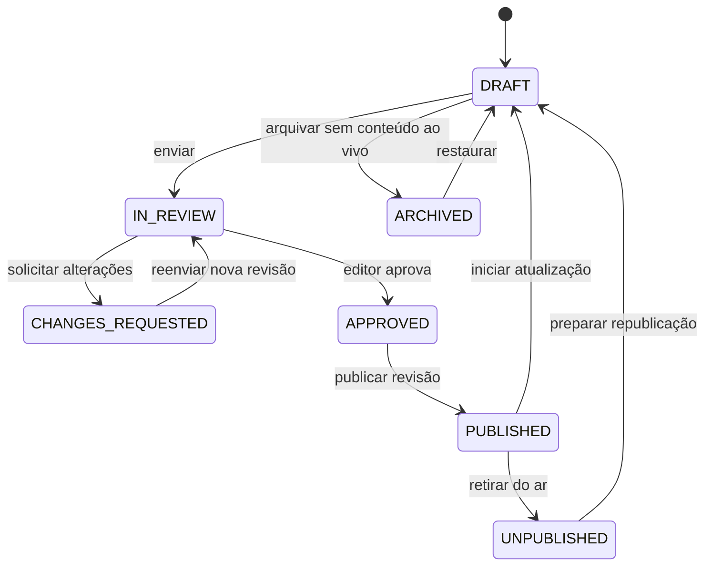

# Workflow editorial

Status: política proposta na Fase 0  
Escopo: primeira vertical editorial

## 1. Princípios

- Autor escreve; revisor verifica; editor aprova e publica.
- Permissões seguem menor privilégio e são verificadas no servidor.
- Toda publicação aponta para uma revisão imutável.
- Autosave não é uma revisão aprovada.
- A versão pública anterior permanece no ar enquanto uma atualização é preparada.
- IA pode sugerir, mas nunca muda estado ou publica automaticamente.
- Notícia, opinião, comunicado, patrocinado e demonstração têm natureza explícita.
- Fonte, autoria, datas, disclosure e correções integram a matéria.
- Toda transição é auditável.

## 2. Jornada prioritária

1. Usuário ativo faz login; sessão e permissões são carregadas no servidor.
2. Redator cria `Article` e `ArticleWorkingCopy`.
3. Autosave usa `lockVersion`; conflito oferece comparação e não sobrescreve.
4. “Enviar para revisão” valida o conteúdo e cria `ArticleRevision` imutável.
5. Revisor comenta, endossa a revisão ou solicita alterações.
6. Redator corrige a working copy e, ao reenviar, cria outra revisão.
7. Editor aprova uma revisão exata.
8. Editor publica imediatamente; agendamento será adicionado depois da vertical básica.
9. Publicação troca `publishedRevisionId` atomicamente.
10. Homepage e `/noticias/[slug]` leem exclusivamente essa revisão.

## 3. Estados

O diagrama apresenta rótulos de negócio. No banco, workflow e publicação são eixos separados. Iniciar uma atualização muda o estado editorial para `DRAFT`, mas preserva `PublicationStatus=PUBLISHED` e a revisão anterior no ar.

## 4. Transições e guardas

| Origem | Destino/ação | Ator | Guardas |
|---|---|---|---|
| criação | `DRAFT` | Redator+ | artigo e working copy na mesma transação |
| `DRAFT` | `IN_REVIEW` | Autor/Editor | campos mínimos, revisão criada e sem conflito |
| `IN_REVIEW` | pedido de alterações | Revisor/Editor | comentário obrigatório e revisão alvo atual |
| `IN_REVIEW` | endosso de revisão | Revisor | decisão registrada na revisão exata |
| `CHANGES_REQUESTED` | `IN_REVIEW` | Autor/Editor | nova revisão imutável |
| `IN_REVIEW` | `APPROVED` | Editor+ | revisão endossada, sem blockers |
| `APPROVED` | `PUBLISHED` | Editor com `publish` | validação repetida dentro da transação |
| `APPROVED` | `SCHEDULED` | Editor com `schedule/publish` | revisão e instante futuro fixados |
| `SCHEDULED` | `PUBLISHED` | Job idempotente/Editor | mesma revisão, horário atingido e lock |
| `SCHEDULED` | cancelado | Editor | motivo auditado |
| `PUBLISHED` | nova `DRAFT` | Autor autorizado | clona a revisão pública; público não muda |
| `PUBLISHED` | `UNPUBLISHED` | Editor+ | motivo obrigatório |
| `UNPUBLISHED` | nova `DRAFT` | Editor+ | prepara nova revisão |
| não público | `ARCHIVED` | Editor-chefe+ | nenhum conteúdo ao vivo/agendado |
| `ARCHIVED` | `DRAFT` | permissão `restore` | nova working copy e evento |

Não há atalho normal `DRAFT → PUBLISHED`. Qualquer mudança depois de `APPROVED` invalida a aprovação. Override excepcional exige permissão dedicada, motivo e registro explícito.

## 5. Revisões e autosave

- working copy é mutável e isolada da revisão publicada;
- autosave é debounced e versionado;
- falha de rede não limpa o estado local;
- conflito retorna erro de domínio/HTTP 409;
- revisão imutável é criada em checkpoints: submissão, pedido de mudanças, aprovação, publicação e restauração;
- comparação usa revisões, não cada keystroke;
- restaurar copia uma revisão antiga para nova versão;
- duplicar cria outro artigo em rascunho, sem slug reservado, urgência ou datas;
- edição de matéria publicada parte da revisão ao vivo;
- atualização material exige resumo de mudanças;
- correção relevante gera nota visível e `dateModified` verdadeiro.

## 6. Gate de envio para revisão

Obrigatório:

- título, resumo, corpo e slug proposto;
- autor e categoria;
- natureza editorial/disclosure;
- fonte compatível ou justificativa editorial;
- mídia referenciada em estado válido;
- alt contextual quando a imagem transmite informação;
- nenhum conflito de edição.

Conteúdo incompleto permanece rascunho e exibe erros associados aos campos.

## 7. Gate de aprovação/publicação

- revisão alvo continua sendo a atual;
- revisão humana registrada;
- nenhum pedido de alteração aberto;
- autor, editoria, datas e slug válidos;
- HTML regenerado e sanitizado;
- nenhuma mídia removida, rejeitada ou em quarentena;
- canonical sem colisão;
- nenhum `SeoAudit ERROR` sem override permitido;
- patrocinado, opinião, comunicado ou demonstração claramente rotulado;
- fonte, alt, crédito/licença aplicáveis verificados;
- sugestão de IA conferida por pessoa;
- GEO preenchido somente com fatos confirmados.

SEO title ausente pode usar título editorial; meta description pode usar resumo com warning. É melhor GEO vazio que fato inferido ou citação inventada.

## 8. Publicação transacional

1. Bloquear o artigo por versão/lock.
2. Revalidar sessão, usuário, permissão e escopo.
3. Confirmar que revisão aprovada pertence ao artigo.
4. Reexecutar gates editoriais, mídia e SEO.
5. Reservar slug e criar redirect se houver mudança.
6. Atualizar `publishedRevisionId`, estados e timestamps.
7. Criar `ArticleWorkflowEvent` e `AuditLog`.
8. Commit.
9. Revalidar matéria, homepage, categoria, sitemap e feed.

Falha de cache não desfaz o banco. Ela deve ser registrada e retentada; TTL de segurança limita obsolescência.

## 9. Papéis e permissões iniciais

| Papel | Criar/editar | Revisar | Aprovar | Publicar/retirar | RBAC |
|---|---|---|---|---|---|
| `SUPER_ADMIN` | qualquer | sim | sim | sim, com override auditado | total |
| `EDITOR_CHEFE` | qualquer editorial | sim | sim | sim | não por padrão |
| `EDITOR` | qualquer editorial | sim | sim | sim | não |
| `REVISOR` | comentários/ajustes autorizados | atribuídos | não final | não | não |
| `REDATOR` | próprios em rascunho/correção | envia próprios | não | não | não |
| `ADMIN` | conforme grants | conforme grants | não automático | não automático | gerencia acesso |
| demais papéis | sem capacidade editorial inicial | não | não | não | não |

RBAC é combinado com guardas:

- `OWN`: criou ou é autor da matéria;
- `ASSIGNED`: é revisor/editor designado;
- `ANY`: alcance global naquele recurso;
- estado permite a ação;
- revisão alvo não ficou obsoleta;
- conteúdo não mudou após endosso/aprovação.

Botão oculto é apenas UX. A segurança está no caso de uso servidor.

## 10. Preview, retirada e arquivamento

- preview exige sessão/permissão ou token assinado, curto e revogável;
- preview envia `noindex, nofollow` e não entra em sitemap/feed;
- agendamento recebe horário em `America/Recife` e persiste UTC;
- job agendador é idempotente;
- retirada exige motivo, remove de homepage/feed/sitemap e preserva histórico;
- resposta pública após retirada segue política editorial: 404/410, redirect ou página com nota;
- artigo só é arquivado quando não está ao vivo;
- exclusão de artigo publicado é uma operação composta: retirar, justificar, depois soft delete.

## 11. Conteúdo patrocinado, opinião e demonstração

- natureza é obrigatória e versionada;
- disclosure aparece antes do corpo quando aplicável;
- patrocinador não altera autoria jornalística;
- conteúdo demonstrativo usa rótulo inequívoco;
- urgência e destaque não são copiados ao duplicar;
- referência visual nunca vira notícia real;
- publicidade e conteúdo editorial não compartilham o mesmo rótulo visual.

## 12. Auditoria mínima

Registrar:

- login bem-sucedido, falha relevante e logout;
- criação e autosaves significativos;
- checkpoint de revisão;
- envio, endosso e pedido de alterações;
- aprovação, agendamento, publicação e retirada;
- restauração, duplicação e soft delete;
- mudança de atribuição, papel e permissão;
- override de SEO/workflow;
- mudança de slug/redirect;
- mudança de urgência, destaque ou homepage.

O log guarda IDs, hash, campos alterados, ator, data, request ID e motivo. Não guarda corpo completo, senha, token, cookie ou fonte confidencial.

## 13. Notificações

Notificações de atribuição, pedido de alterações, aprovação e publicação serão internas e, depois, por e-mail opcional. A ausência de SMTP não pode bloquear o workflow. Notificação não é a fonte de verdade; a fila editorial deriva do banco.

## 14. Critérios E2E

1. Anônimo não acessa `/admin`.
2. Redator cria e envia, mas não aprova/publica.
3. Revisor solicita alterações ou endossa a revisão.
4. Editor aprova e publica.
5. Ações fora da permissão falham.
6. Rascunho nunca aparece no portal.
7. Homepage e página usam a mesma revisão publicada.
8. Nova edição não aprovada não altera a matéria ao vivo.
9. Toda transição possui auditoria.
